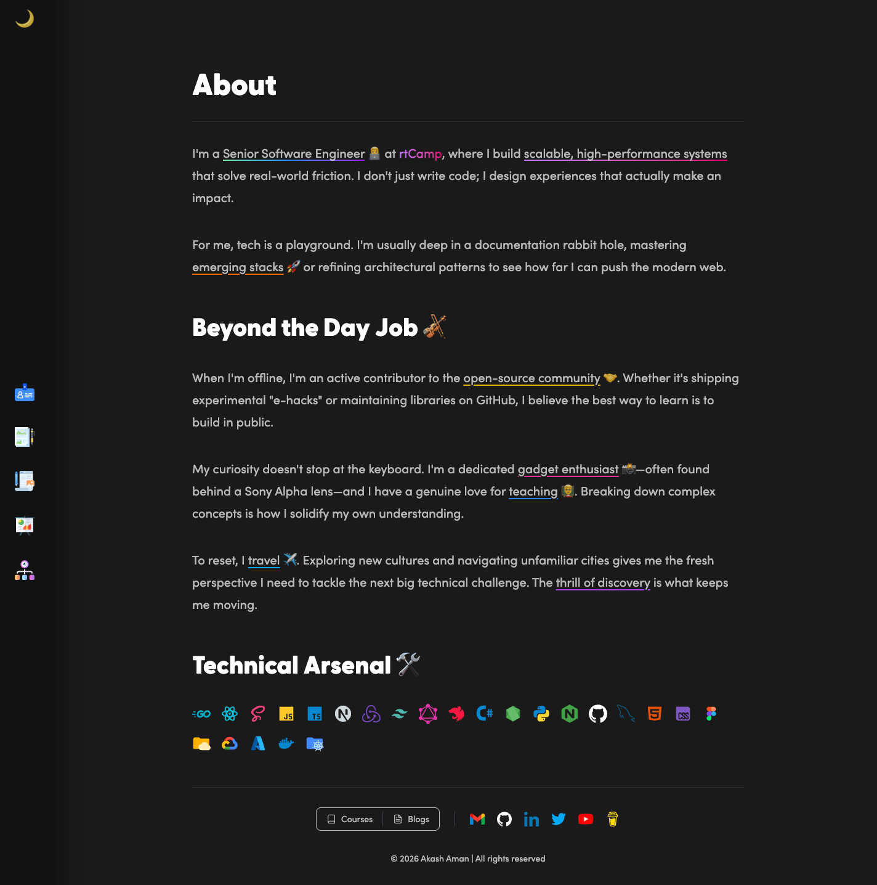
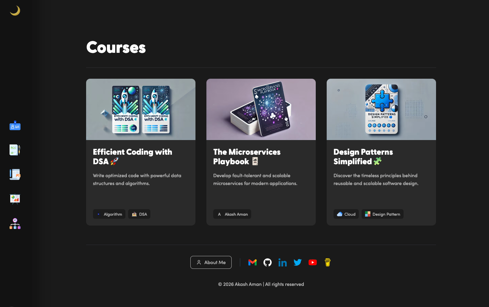
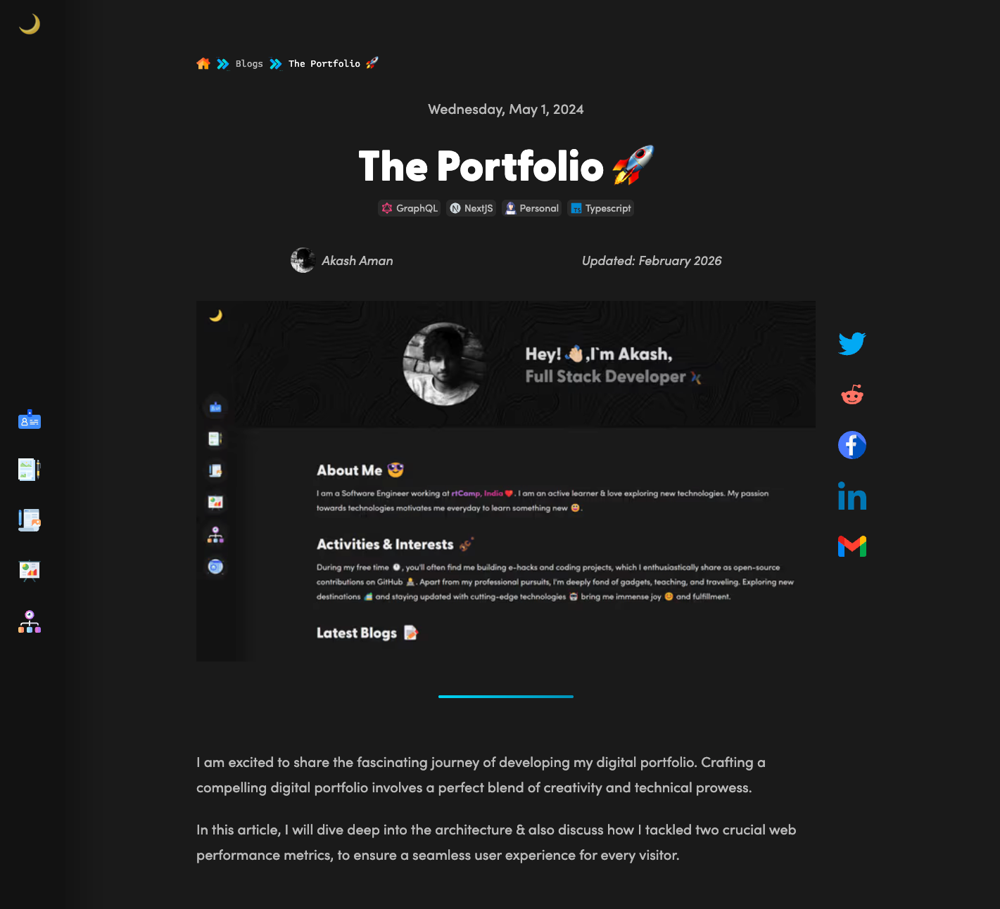
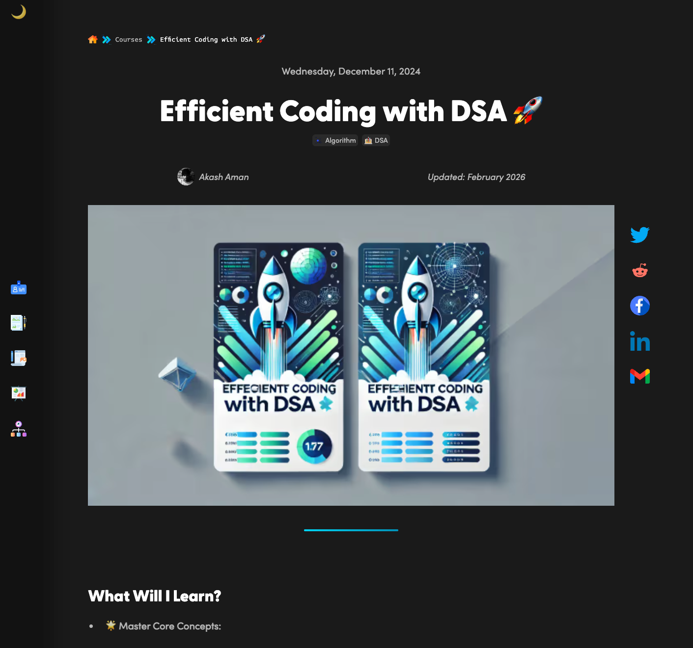
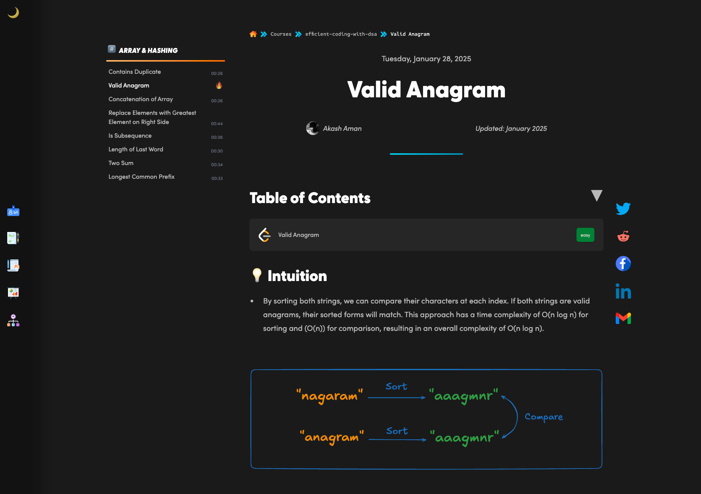

# akash.cx

  
  
   
  
  ## 🚀 Modern Developer Portfolio & Educational Platform
  
  

    
    
    
    
    
  

---

## 📖 About

**akash.cx** is my digital garden 🌱—a personal portfolio, technical blog, and educational platform built to push the boundaries of modern web performance. It stands as a live demonstration of full-stack engineering, cleaner code architecture, and high-performance design patterns.

This project is an evolution of my earlier portfolio, which can be found at [akash-aman.vercel.app](https://akash-aman.vercel.app/) and its source code is available at [GitHub](https://github.com/akash-aman/portfolio).

### ✨ Key Features

- **PWA Ready**: Installable as a native-like app on all devices.
- **Markdown-Powered**: Detailed technical articles with GFM, math (Katex), and syntax highlighting.
- **Interactive Timeline**: A visual journey through my engineering career.
- **Dynamic Projects**: Tech-stack integrated grid showcasing my work.

---

## ⚡️ Technical Highlights

### On-Demand ISR Implementation

This site leverages **Next.js Incremental Static Regeneration (ISR)** with on-demand revalidation.

- **Start**: Pages are statically generated at build time for maximum speed.
- **Update**: When content changes in the CMS, a webhook triggers `/api/revalidate`.
- **Result**: The specific path is instantly regenerated. Users always see the latest content without waiting for a full site rebuild.

### Hybrid Rendering Strategy

- **Static First**: Core pages (Home, Projects) are statically optimized.
- **Dynamic Edge**: Educational course trackers rely on dynamic paths.
- **Optimized Assets**: Blur placeholders for remote images generated server-side using `plaiceholder`.

---

## 📚 Courses & Education

A dedicated platform for structured learning paths, offering comprehensive courses and deep dives into modern software engineering concepts and best practices.

---

## 🛠 Tech Stack

| Category          | Technology                                                                                   |
| ----------------- | -------------------------------------------------------------------------------------------- |
| **Framework**     | [Next.js 16](https://nextjs.org/) (App Directory)                                            |
| **Language**      | [TypeScript](https://www.typescriptlang.org/)                                                |
| **Styling**       | [Tailwind CSS v4](https://tailwindcss.com/) & SASS                                           |
| **Data Fetching** | [GraphQL](https://graphql.org/) & [Apollo Client](https://www.apollographql.com/docs/react/) |
| **Content**       | `react-markdown`, `remark-gfm`, `remark-math`, `rehype-katex`, `rehype-slug`, `rehype-raw`   |
| **Optimization**  | `@ducanh2912/next-pwa`, `on-demand ISR`                                                      |

## 📝 License

This project is open source and available for learning and reference.

---

## 📸 Screenshots

 

  

   

  
  
   

  

   

  

   

  

   

  

